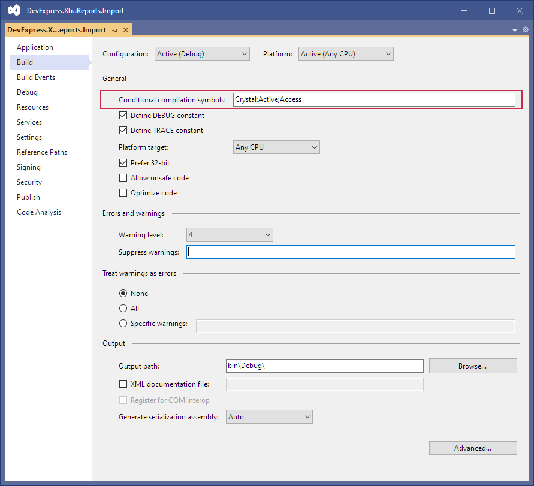
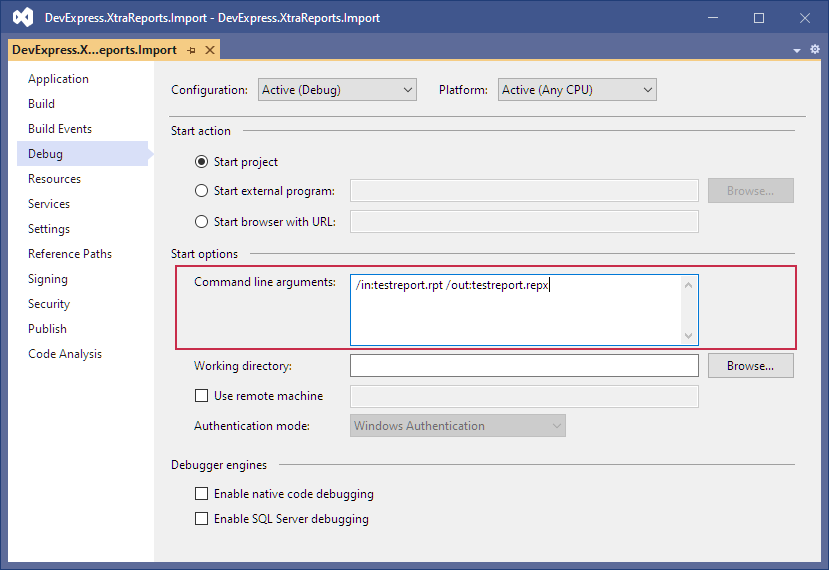

# Overview

This repository contains a console application project designed to convert third-party reports into DevExpress Report Definition (.REPX) files. You can use these .REPX files to [load report layouts](https://docs.devexpress.com/XtraReports/2666/detailed-guide-to-devexpress-reporting/store-and-distribute-reports/store-report-layouts-and-documents/load-report-layouts) within the DevExpress Visual Studio Report Designer, DevExpress End-User Report Designer, or display the report at runtime.

# How to Compile and Run the Project

> _This report conversion tool is limited in scope (due to differences between DevExpress Reports and other reporting tools). Review the [requirements and limitations](https://docs.devexpress.com/XtraReports/1468/get-started-with-devexpress-reporting/add-a-report-to-your-.net-application/convert-third-party-reports-to-devexpress-reports#requirements) related to this product before you convert reports._
> 
> _This project intentionally does not contain third-party libraries. To compile the application, add references to required assemblies._

## Prerequisites

1. This project references the [Crystal Reports](https://www.sap.com/products/technology-platform/crystal-reports.html) and [Active Reports](https://developer.mescius.com/activereports) libraries. You must install the libraries yourself. Please note that third-party libraries must be installed and used in accordance with the relevant license agreement.

## Configuration

1. Specify library vendors in the **Build** Tab’s **Conditional compilation symbols** field. Initially it has the list of all supported third-party suppliers (all are enabled by default). Delete unnecessary names from the list.

    

 1. Open the **Debug** tab and specify the input and output file names (the **in** and **out** parameters) in the  **Command line arguments**:


    

# Examples of use

You can launch the application from Visual Studio or from the command line and specify the **in** and **out** parameters.
Use the following command to convert multiple reports at a time:

```
FOR /R Reports %R IN (*.rpt) DO ReportsImport "/in:%R" "/out:%R.repx"
```

The following command converts an individual report: 

```
ReportsImport /in:c:\0\crystal\file.rpt /out:c:\0\converted\testreport.repx
```

# RDL/RDLC and Crystal Reports Conversion Specifics

If an RDL/RDLC or Crystal Reports function cannot be converted, it is replaced with the **"NOT_SUPPORTED"** message, as in the following [expression](https://docs.devexpress.com/XtraReports/120091/detailed-guide-to-devexpress-reporting/use-expressions) example:

| RDL/RDLC | Crystal | DevExpress |
| --- | --- | --- |
| =IsDate(Fields!Column.Value) | IsDate({report.Column}) | Iif(True, '#NOT_SUPPORTED#', 'IsDate([Column])') |

Set the **UnrecognizedFunctionBehavior** option to **Ignore** to leave unrecognized functions in expressions.

RDL/RDLC Reports:
```
ReportsImport /in:c:\0\rdlc\file.rdlc /out:c:\0\converted\testreport.repx /ssrs:UnrecognizedFunctionBehavior=Ignore
```

Crystal Reports:
```
ReportsImport /in:c:\0\crystal\file.rpt /out:c:\0\converted\testreport.repx /crystal:UnrecognizedFunctionBehavior=Ignore
```

The command listed above produces a .REPX file with the unrecognized *IsDate* function:

| RDL/RDLC | Crystal | DevExpress |
| --- | --- | --- |
| =IsDate(Fields!Column.Value) | IsDate({report.Column}) | IsDate([Column]) | 

You can implement [custom functions](https://docs.devexpress.com/XtraReports/DevExpress.XtraReports.Expressions.CustomFunctions) to support unrecognized functions in DevExpress reports (the *IsDate* custom function in the sample above).

